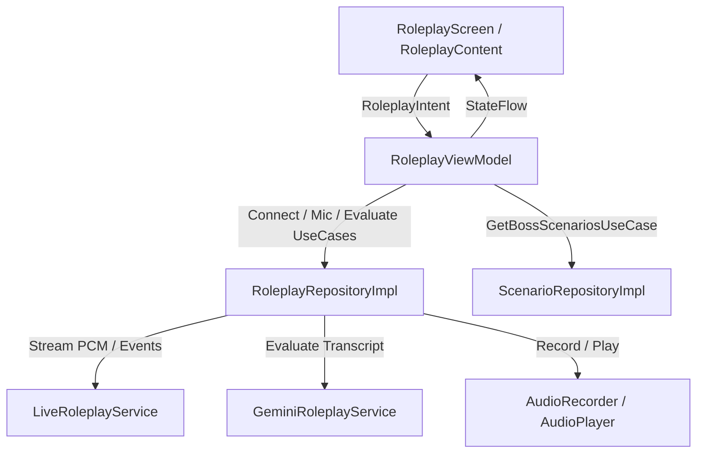

# Roleplay & Boss Challenge Feature

## Overview
The **Roleplay & Boss Challenge** feature delivers an interactive, voice-driven AI language simulation in LinguaQuest. Users engage in real-time spoken conversations with contextual AI boss characters (e.g., barista, immigration officer) and receive automated feedback and grading on their task completion, fluency, and mistakes.

---

## AI Architecture & Data Flow

### 1. Dual AI Engine
1. **Gemini Live Multimodal API (`LiveRoleplayService`)**:
   - Model: `gemini-2.5-flash-native-audio-preview-12-2025`
   - Role: Real-time, bidirectional audio streaming. Receives 16kHz PCM audio buffers from `AudioRecorder`, streams raw audio chunks back to `AudioPlayer`, and produces real-time speech-to-text transcriptions for both user and AI.
2. **Generative Content API (`GeminiRoleplayService`)**:
   - Model: `gemini-3.5-flash-lite`
   - Role: Structured JSON post-stage assessment via `evaluateBossStage`. Evaluates conversation transcripts against task objectives to compute fluency score, completion status, and granular grammar/vocabulary feedback.

### 2. Audio Processing Pipeline
- **Input (`AudioRecorder`)**: Captures mono 16-bit PCM at 16kHz via `AudioRecord`, enabling Android `AcousticEchoCanceler` when available on hardware.
- **Output (`AudioPlayer`)**: Low-latency PCM streaming playback via `AudioTrack` on an `AudioManager.STREAM_VOICE_CALL` channel.

---

## Clean Architecture & MVI Layering

### Domain Layer
- **UseCases**:
  - `ConnectToBossStageUseCase`: Connects live WebSocket session with custom persona prompt.
  - `ObserveLiveEventsUseCase`: Observes incoming audio chunks, transcriptions, and turn completions.
  - `StartMicrophoneUseCase` / `StopMicrophoneUseCase`: Controls voice capture.
  - `EvaluateBossStageUseCase`: Invokes end-of-stage evaluation on Gemini.
  - `GetBossScenariosUseCase`: Retrieves boss scenarios based on device/user language.
  - `DisconnectRoleplayUseCase`: Gracefully shuts down audio streams and AI sessions.

### Presentation Layer (MVI)
- **State**: `RoleplayState` holding timer, transcription history, speech status, evaluation results, and connection status.
- **Intent**: `RoleplayIntent` (`StartBossStageClicked`, `RecordClicked`, `StopRecordingClicked`, `FinishStageClicked`, `RetryStageClicked`, etc.).
- **Effect**: `RoleplayEffect` (`NavigateToHome`).

---

## Refactoring & Integrity Improvements
1. **Logging Standards**: All logging strictly uses `Timber`. All `android.util.Log` and `printStackTrace` instances removed.
2. **Job & Scope Lifecycle**: Server event listener and microphone recording coroutines are tracked in `RoleplayRepositoryImpl` and explicitly cancelled during `disconnect()`.
3. **Clean Architecture Compliance**: ViewModels no longer directly access `ScenarioRepository`; operations are delegated via `GetBossScenariosUseCase`.
4. **Dependency Injection**: Removed inline package references in `RoleplayModule` and added explicit imports.
5. **Dead Code Elimination**: Cleaned up deprecated models (`RoleplayObjective`, `RoleplayResult`, `RoleplayTurnResponse`).
