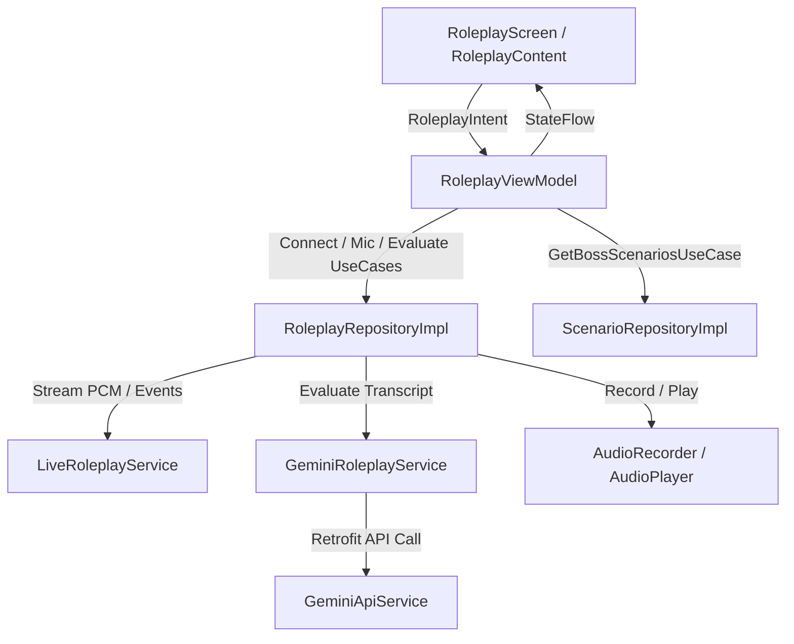

# Roleplay & Boss Challenge Feature

## Overview
The **Roleplay & Boss Challenge** feature delivers an interactive, voice-driven AI language simulation in LinguaQuest. Users engage in real-time spoken conversations with contextual AI boss characters (e.g., barista, immigration officer) and receive automated feedback and grading on their task completion, fluency, and mistakes.

---

## AI Architecture & Data Flow

### 1. Dual AI Engine
1. **Gemini Live Multimodal API (`LiveRoleplayService`)**:
   - Model: `gemini-2.5-flash-native-audio-preview-12-2025`
   - Role: Real-time, bidirectional audio streaming. Receives 16kHz PCM audio buffers from `AudioRecorder`, streams raw audio chunks back to `AudioPlayer`, and produces real-time speech-to-text transcriptions for both user and AI.
2. **Generative Content REST API (`GeminiRoleplayService` & `GeminiApiService`)**:
   - Architecture: Clean Architecture Retrofit service (`GeminiApiService`) with dedicated DTO models (`GeminiRequestDto`, `GeminiResponseDto`) and Hilt dependency injection in `RoleplayModule`.
   - Model Fallback Cascade: Automatic transparent failover across active Google AI models (`gemini-3.5-flash-lite`, `gemini-flash-latest`, `gemini-3.1-flash-lite`, `gemini-3.5-flash`).
   - Authentication: Directly uses `BuildConfig.GEMINI_API_KEY`, completely isolating evaluation quotas from Firebase rate limits and avoiding third-party library conflicts.
   - Role: Structured JSON post-stage assessment via `evaluateBossStage`. Evaluates conversation transcripts against task objectives to compute fluency score, completion status, and granular grammar/vocabulary feedback.

### 2. Audio Processing Pipeline
- **Input (`AudioRecorder`)**: Captures mono 16-bit PCM at 16kHz via `AudioRecord` using `MediaRecorder.AudioSource.VOICE_RECOGNITION` to avoid telephony VoIP AGC muting. Maintains a rolling circular pre-buffer (~250ms) to ensure zero clipped syllables when speech starts concurrently with button presses.
- **Output (`AudioPlayer`)**: Low-latency PCM streaming playback via `AudioTrack` on an `AudioManager.STREAM_VOICE_CALL` channel.

---

## Clean Architecture & MVI Layering



### Domain Layer
- **Models**:
  - `ChatMessage`: Immutable representation of user and AI conversation utterances.
  - `BossScenario` / `ScenarioId`: Strongly typed roleplay scenario definitions.
  - `BossEvaluationResult`: Comprehensive multi-dimensional evaluation results and gamification rewards.
- **UseCases**:
  - `ConnectToBossStageUseCase`: Connects live WebSocket session with custom persona prompt.
  - `ObserveLiveEventsUseCase`: Observes incoming audio chunks, transcriptions, and turn completions.
  - `StartMicrophoneUseCase` / `StopMicrophoneUseCase`: Controls voice capture.
  - `EvaluateBossStageUseCase`: Encapsulates conversation validation, transcript sanitization, anti-gaming script verification, Gemini evaluation, score capping, star allocation, and reward calculations.
  - `GetBossScenariosUseCase`: Retrieves boss scenarios based on device/user language.
  - `DisconnectRoleplayUseCase`: Gracefully shuts down audio streams and AI sessions.

### Presentation Layer (MVI)
- **State**: `RoleplayState` holding timer, transcription history, speech status, evaluation results, and connection status.
- **Intent**: `RoleplayIntent` (`StartBossStageClicked`, `RecordClicked`, `StopRecordingClicked`, `FinishStageClicked`, `RetryStageClicked`, etc.).
- **Effect**: `RoleplayEffect` (`NavigateToHome`, `ShowSnackbarAndNavigateBack`).
- **UI Components & Sound Decoupling**:
  - `LocalSoundPlayer`: Audio triggers (`OPEN_MIC`, `CLOSE_MIC`, `SUCCESS`, `FAIL`) are handled exclusively at the UI/Composable layer via `LocalSoundPlayer`, keeping ViewModels pure and decoupled from Android UI sounds.
  - `AiTypingIndicator`: WhatsApp-style 3-dot staggered bouncing animation bubble displayed in the chat transcript when the AI is processing a response.
  - `LingoRoleplayAvatar`: Dynamic avatar reacting to live states (`idle`, `mic`, `speaking`, `loading`, and `thinking` using `lingo_mind_thinking`).
  - `PushToTalkButton`: Custom animated press-to-speak interaction component with `isEnabled` guard wired strictly to `!state.isAiSpeaking`, ensuring users can immediately re-record if speech was not detected while locking input during active AI speech output.
  - `BossSuccessView` / `BossFailView`: State-driven result presentation containers.
  - `StarRatingRow`: 1–3 star visual rating indicator.
  - `ScoreMetricItem`: Individual metric card for score percentages.
  - `BossScoreBreakdownRow`: Horizontal metrics breakdown for Fluency, Grammar, and Vocabulary.
  - `BossFeedbackBox`: Translucent scrollable card with strengths and targeted improvements.
  - `BossRewardRow`: Dynamic XP and Coin reward pill container.
  - `ActiveLiveChatView`: Real-time streaming conversation transcript display with auto-scrolling, dynamic status text ("Hold to Speak", "Release to Send", "AI is thinking...", "AI is speaking..."), and inline typing bubbles.

---

## Refactoring & Integrity Improvements
1. **Logging Standards**: All logging strictly uses `Timber`. All `android.util.Log` and `printStackTrace` instances removed.
2. **Job & Scope Lifecycle**: Server event listener and microphone recording coroutines are tracked in `RoleplayRepositoryImpl` and explicitly cancelled during `disconnect()`.
3. **Clean Architecture Compliance**: ViewModels no longer directly access `ScenarioRepository`; operations are delegated via `GetBossScenariosUseCase`.
4. **Dependency Injection & Clean Retrofit Integration**: `GeminiApiService` provided via Hilt in `RoleplayModule` with dedicated DTO models, isolating external AI endpoints from the main backend Retrofit client.
5. **Dead Code Elimination**: Cleaned up deprecated models (`RoleplayObjective`, `RoleplayResult`, `RoleplayTurnResponse`).
6. **Graceful Connection Loss Recovery**: When a live WebSocket session drops or receives a GoAway event, the session is cleanly halted, a descriptive Snackbar is displayed, and the user is routed back safely to the lobby.

---

## Multi-Language Support & Language Enforcement

### Dynamic Script & Language Awareness
1. **Multi-Language Detection**: `TranscriptSanitizer.calculateTargetLanguagePercentage` dynamically adapts based on the active `targetLanguage`:
   - If learning **Arabic**: Arabic Unicode blocks are counted as target characters, and Latin script is counted as non-target.
   - If learning **English / European languages**: Latin alphabet characters are counted as target characters, and Arabic Unicode is counted as non-target.
2. **Conditional Transliteration Sanitization**:
   - Phonetic mapping substitutions are only executed when target language is non-Arabic, preventing legitimate Arabic dialogues from being mutated.
3. **Evaluation Use Case Calibration**:
   - `EvaluateBossStageUseCase` queries `UserPreferencesRepository` to supply the exact target language to both the Gemini evaluation prompt and programmatic script sanitizer.
4. **Client-Side Safety Net**:
   - If `combinedTargetPercentage < 50`, `task_completed` is set to `false`, capping the score at 35 and preventing gaming. When legitimate target speech is detected, the full Gemini evaluation is honoured with XP and coin rewards.

### Evaluation Schema & Multi-Dimensional Scoring
```json
{
  "task_completed": true,
  "fluency_score": 85,
  "grammar_score": 90,
  "vocabulary_score": 80,
  "target_language_percentage": 95,
  "feedback_message": "Great job! You negotiated the price effectively.",
  "strengths": [
    "Used polite conditional phrasing",
    "Maintained natural pacing"
  ],
  "improvements": [
    "Practice using varied currency denominations"
  ]
}
```

The `target_language_percentage` metric is used internally for anti-gaming enforcement and is not directly displayed to the user.

---

## Pedagogical Evaluation & Gamification System

### 1. Multi-Dimensional Assessment
- **Fluency & Task Completion**: Assesses whether the user fulfilled the situational boss objective and communicated smoothly.
- **Grammar Sub-Score (0–100)**: Evaluates sentence structure, verb conjugations, and syntax accuracy.
- **Vocabulary Sub-Score (0–100)**: Evaluates lexical range, context appropriateness, and situational term usage.
- **Actionable Bullet Points**:
  - `strengths`: Concrete aspects the user excelled at.
  - `improvements`: Targeted tips for immediate learning enhancement.

### 2. Gamified Star Ratings, Dynamic Rewards & Wallet Persistence
- **3 Stars (Outstanding!)**: Fluency $\ge 85\%$ $\rightarrow$ `+200 XP`, `+75 Coins`
- **2 Stars (Great Job!)**: Fluency $70\% - 84\%$ $\rightarrow$ `+150 XP`, `+50 Coins`
- **1 Star (Good Effort!)**: Fluency $50\% - 69\%$ $\rightarrow$ `+100 XP`, `+25 Coins`
- **0 Stars / Failed**: Fluency $< 50\%$ or Task Incomplete $\rightarrow$ `0 XP`, `0 Coins`, displays targeted improvement tips and retry button.
- **Wallet Persistence**: Upon stage completion, `RoleplayViewModel` invokes `AdjustWalletUseCase` to persist the earned XP and Coins to the remote and local database, instantly updating the global wallet state.
- **Audio Feedback**: `BossResultView` plays `AppSound.SUCCESS` followed by `AppSound.AddedMoney` when coins are earned, or `AppSound.FAIL` on stage failure.

### 3. Evaluator Determinism & JSON Parsing Robustness
- **Low Temperature (0.1)**: `GeminiRoleplayService` uses a strictly constrained `temperature = 0.1f` for evaluation to ensure reproducible and consistent scoring across identical transcripts.
- **Markdown Stripping & JSON Sanitization**: A dedicated `cleanJson()` utility strips any codeblock wrappers (````json ... ````) or trailing markdown before passing the response to Gson, eliminating deserialization crashes.
- **Brief Conversation Safety Net**: If the user ends the stage with less than 2 speech turns, the system cleanly fails the evaluation with `ERROR_SHORT_CONVERSATION` and instructs the user to engage in dialogue before completing.

### 4. Native Language Enforcement & ASR Artifact Sanitization
- **`TranscriptSanitizer`**: Pre-processes incoming and historical speech chunks to convert known phonetic STT artifacts (e.g. Devanagari/Hindi `हेलो` $\rightarrow$ `Hello`, Arabic `نو` $\rightarrow$ `No`, `يس` $\rightarrow$ `Yes`, `أوكيه` $\rightarrow$ `Okay`) into clean Latin target language text.
- **Deterministic Script Ratio Verification**: `TranscriptSanitizer.calculateTargetLanguagePercentage()` measures the ratio of target characters (Latin alphabet) against native script characters (Arabic) across all user utterances.
- **Client-Side Task Completion Gate**: If the user conducted $<50\%$ of their speech in the target language, `EvaluateBossStageUseCase` enforces `task_completed = false`, caps the fluency score $\le 35\%$, and ensures 0 stars are awarded.
- **Live In-Character Persona Nudges**: If the user speaks sentences in their native language (Arabic), the live AI boss character stays in character and prompts them in English to speak English (e.g., *"Pardon me? I only speak English here, my dear! Could you say that in English for me?"*).
- **Accidental ASR Keyword Filtering**: `TranscriptSanitizer.filterImprovements()` filters out false-positive mentions of accidental STT languages (e.g. "Hindi", "Devanagari") while allowing pedagogical suggestions that guide the user to speak English.

---

## Audio Pipeline & VAD Reliability

### 1. Rolling Circular Pre-Buffer (~250ms)
- Human speech frequently starts at the exact millisecond a touch press begins.
- `AudioRecorder` maintains a rolling 5-chunk circular buffer (`ArrayDeque<ByteArray>`) during idle recording.
- When `resumeSending()` is triggered, all pre-buffered chunks are instantly flushed before real-time audio streams, guaranteeing that the first syllable (e.g., *"Hello"*) is never clipped.

### 2. AudioSource Optimization
- Hardware recording uses `MediaRecorder.AudioSource.VOICE_RECOGNITION` instead of `VOICE_COMMUNICATION`.
- Eliminates VoIP telephony hardware ducking and initial AGC dampening, ensuring high sensitivity and immediate speech clarity.

### 3. Silence Tail Padding (End-of-Turn Signal)
Gemini's native multimodal audio model relies on Voice Activity Detection (VAD) to identify the end of a user turn. When streaming audio cuts off abruptly without trailing silence, the VAD cannot confidently trigger turn-completion, resulting in unanswered turns or hallucinated gibberish transcripts.
- **Solution**: Upon mic release, `RoleplayRepositoryImpl.stopMicrophone()` asynchronously streams ~1.0 second of zero-byte PCM audio (32,000 bytes @ 16kHz mono 16-bit) in 3,200-byte chunks to provide a crisp, reliable end-of-speech signal to Gemini.

### 4. Hold-to-Talk Interaction Model & Gesture Node Persistence
- Replaced toggle-based recording with a true press-and-hold interaction via Compose `detectTapGestures` in `PushToTalkButton`.
- **Node Persistence Architecture**: The button is built on a single persistent `Box` composable utilizing `animateColorAsState` and `animateDpAsState` rather than conditional `if/else` composable branching. This prevents Compose from unmounting the layout node during active touch tracking, ensuring reliable `onPress` and `tryAwaitRelease` event resolution.
- Pressing down triggers `startMicrophoneUseCase` (flushing pre-buffer, opening audio emission) and playing `OPEN_MIC` sound.
- Releasing triggers `stopMicrophoneUseCase` (pausing emission, transmitting silence tail) and playing `CLOSE_MIC` sound.
- UI displays dynamic feedback ("Hold to Speak" when idle, "Release to Send" when active).

### 5. Diagnostic Logging
- Full lifecycle trace across `AudioRecorder`, `LiveRoleplayService`, and `RoleplayRepositoryImpl` with structured `[AudioRecorder]`, `[LiveService]`, and `[Repo]` Timber tags.
- Sampled chunk emission/transmission counters (first 5, then every 100th) prevent log flooding while providing complete visibility in Logcat.

