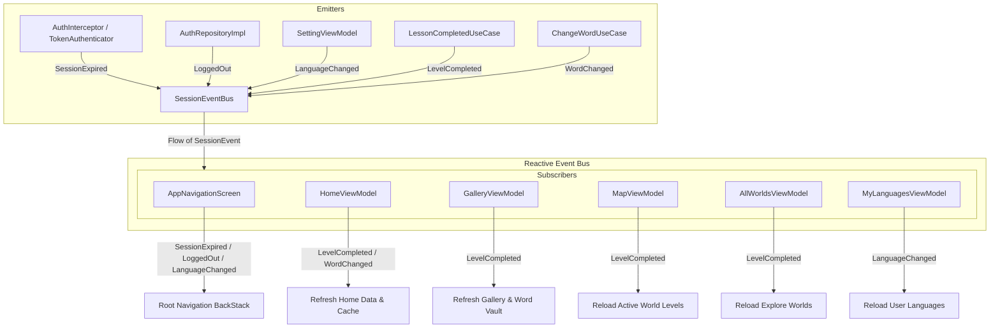

# Session Management & Global SessionEventBus Architecture

## Overview
The `SessionEventBus` architecture serves as the centralized, reactive event-driven backbone of LinguaQuest. It coordinates cross-cutting lifecycle events across the app, including authentication session management (e.g. token expiration and logout), user preference modifications (e.g. app language changes), and gameplay milestones (e.g. completing levels or changing words).

---

## Architectural Diagram

---

## Session Events Contract (`SessionEvent`)

The sealed interface `SessionEvent` defines all global session signals:

| Event | Fired By | Trigger Condition | Primary Subscribers & Actions |
|---|---|---|---|
| `SessionEvent.SessionExpired` | `AuthInterceptor`, `TokenAuthenticator` | Protected API returns `401`/`403` or token refresh fails | `AppNavigationScreen`: Clears backstack, routes to `RootScreen.Login`, and shows warning snackbar. |
| `SessionEvent.LoggedOut` | `AuthRepositoryImpl` | User explicitly logs out from settings | `AppNavigationScreen`: Clears backstack and routes to `RootScreen.Onboarding`. |
| `SessionEvent.LanguageChanged` | `SettingViewModel` | User changes app system language | `AppNavigationScreen`: Re-roots to `RootScreen.Main`. `MyLanguagesViewModel`: Refreshes languages list. |
| `SessionEvent.LevelCompleted` | `LessonCompletedUseCase` | Level verification succeeds (`GameResultUiState.Success`) | `HomeViewModel`: Refreshes summary, stats, and missions. `GalleryViewModel`: Refreshes captures and vocabulary vault. `MapViewModel`: Reloads active world level statuses. `AllWorldsViewModel`: Reloads world progress. |
| `SessionEvent.WordChanged` | `ChangeWordUseCase` | User swaps level target word in game | `HomeViewModel`: Refreshes continue level card and home summary. |

---

## Detailed Component Lifecycle

### 1. Level Completion Pipeline
1. **Verification & Capture**: When a player captures an image, `GameProcessingViewModel` verifies the object against the target word. If matched, the photo is stored in the local vault via `SaveVaultImageUseCase`, and the user is directed to the Game Result screen.
2. **Result Evaluation**: `GameResultScreen` initializes `GameResultViewModel.setInitialResult()` with `GameResultUiState.Success`.
3. **Event Emission**: `GameResultViewModel` invokes `LessonCompletedUseCase`, which:
   - Synchronizes dynamic streak counters with `AppIconSyncUseCase`.
   - Emits `SessionEvent.LevelCompleted` into `SessionEventBus`.
4. **Subscriber Invalidation**:
   - **`HomeViewModel`**: Automatically fetches updated XP, coin balance, and active missions.
   - **`GalleryViewModel`**: Triggers `refreshWords()` to pull new word captures and vault entries into Room.
   - **`MapViewModel`**: Triggers `loadLevels(worldId, force = true)` to mark the completed level as finished and unlock subsequent levels on the map.
   - **`AllWorldsViewModel`**: Re-queries world progress percentages.

### 2. Authentication & Invalidation Pipeline
1. **Protected Requests**: Network calls include JWT bearer tokens attached by `AuthInterceptor`.
2. **Expiration Detection**:
   - `TokenAuthenticator` intercepts `401 Unauthorized` responses and attempts `POST /auth/refresh-token`.
   - If token refresh fails or an unrecoverable `401/403` occurs, `TokensLocalDataSource` and `SessionManagerDataSource` are cleared, and `SessionEvent.SessionExpired` is emitted.
3. **App Redirection**: `AppNavigationScreen` catches the expiration event and navigates to the login screen.

---

## Dependency Injection
- `SessionEventBus` is defined in `core/session/SessionEventBus.kt` and bound as a `@Singleton` via `SessionModule`.
- ViewModels and UseCases inject `SessionEventBus` directly to publish or observe events through Kotlin `Flow`.
