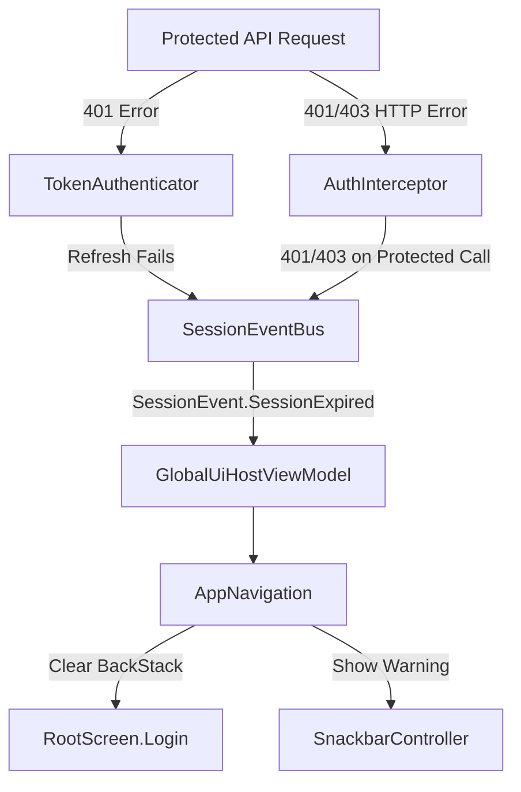

# Session Management & Automatic 401/403 Handling

## Overview
The Session Management architecture handles user authentication states, token lifecycles, and session invalidation across the app. When protected API calls receive `401 Unauthorized` or `403 Forbidden` (or when token refresh fails), the app automatically invalidates local authentication tokens, clears cached session tables, and redirects the user to the Login screen with a "Session expired" message.

---

## Architectural Components

### 1. Core / Session Layer
- **`SessionEvent`**: Sealed interface defining session events:
  - `SessionEvent.SessionExpired`: Triggered when an authentication token expires or server returns 401/403 on a protected route.
  - `SessionEvent.LoggedOut`: Triggered when the user explicitly logs out from settings.
- **`SessionEventBus`**: Singleton reactive event bus implemented via `MutableSharedFlow<SessionEvent>` to emit session state changes across the application.
- **`SessionModule`**: Hilt DI module binding `SessionEventBusImpl` to `SessionEventBus`.

### 2. Network Layer
- **`AuthInterceptor`**:
  - Automatically attaches `Authorization: Bearer <token>` to protected endpoints (those without `@NoAuth`).
  - Intercepts responses: if a protected endpoint returns `401` or `403`, it clears `TokensLocalDataSource` and `SessionManagerDataSource`, and emits `SessionEvent.SessionExpired`.
- **`TokenAuthenticator`**:
  - Handles `401 Unauthorized` retries by executing `POST /auth/refresh-token`.
  - If the refresh token is missing or refresh fails, it cleans up tokens and session data, and emits `SessionEvent.SessionExpired`.

### 3. Repository Layer
- **`AuthRepositoryImpl`**:
  - `isLoggedIn()` validates both DataStore's `isLoggedIn` flag and the presence of a non-empty `accessToken` in `TokensLocalDataSource`.
  - `logout()` clears remote session, tokens, onboarding preferences, database tables, and emits `SessionEvent.LoggedOut`.

### 4. Navigation & UI Integration
- **`GlobalUiHostViewModel`**: Injects `SessionEventBus`, `SnackbarController`, and `DialogController`.
- **`AppNavigation`**:
  - Listens to `globalUiHostViewModel.sessionEventBus.events`.
  - On `SessionEvent.SessionExpired`: clears `rootBackStack`, navigates to `RootScreen.Login()`, and triggers a warning snackbar with `R.string.login_error_token_not_valid`.
  - On `SessionEvent.LoggedOut`: clears `rootBackStack` and navigates to `RootScreen.Onboarding`.
